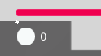
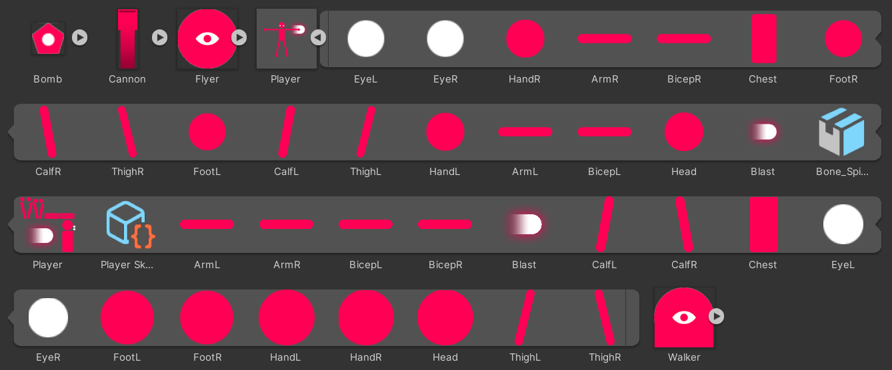
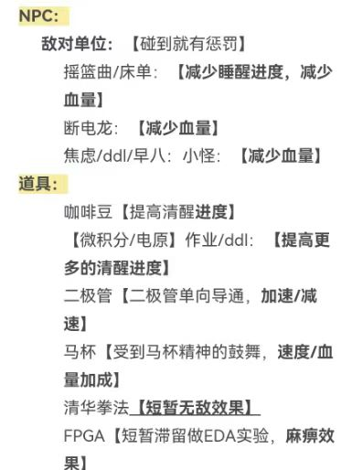

## 可能需要修改的美术素材

**1.加载界面logo**

如下图所示

**2.UI**

菜单界面背景图，开始、退出、帮助、排行榜查询按钮

人物血条、清醒度标志

起跳按钮（移动端需要）

**3.人物**

人物美术素材在 `EndlessRunnerGameKit/Assets/Art/Characters/Player` 里。
由于需要实现动画效果，不能改变图层数及对应名称。

**4.游戏场景**

原场景的美术素材在 `EndlessRunnerGameKit/Assets/Art/Demo` 里，可根据需要进行修改

**5.NPC&道具**

设计相应形象即可。

